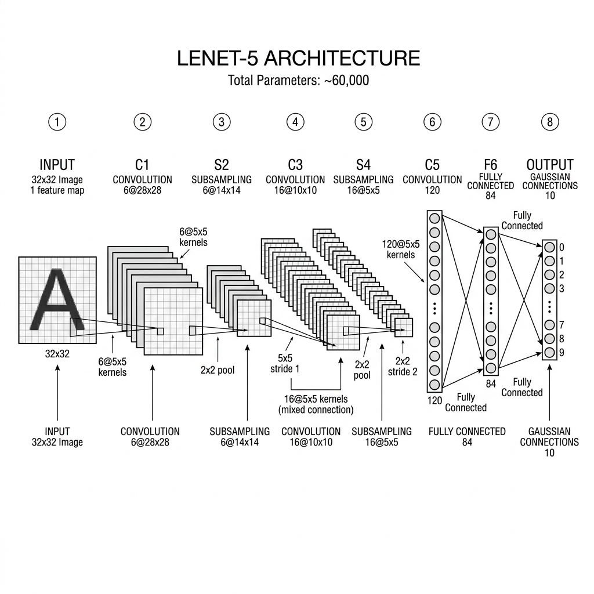
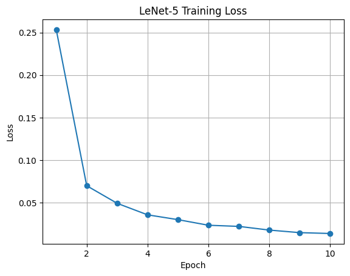

# PyTorch Implementation of LeNet-5 (1998)

## 📌 Objective
A from-scratch PyTorch replication of the foundational Convolutional Neural Network (CNN) architecture introduced in *"Gradient-Based Learning Applied to Document Recognition"* (Yann LeCun et al., 1998). This project validates the original paper's architecture by training and evaluating the model on the MNIST dataset. It features a fully modular codebase, model checkpointing, and interpretability visualizations.

## 🧠 Architecture
The model exactly mirrors the original 7-layer architecture:
* **Input:** 32x32 Grayscale Image (MNIST 28x28 images padded/resized)
* **C1:** Convolutional Layer (6 feature maps) + Tanh
* **S2:** Average Pooling Layer
* **C3:** Convolutional Layer (16 feature maps) + Tanh
* **S4:** Average Pooling Layer
* **C5:** Fully Connected Convolutional Layer (120 feature maps) + Tanh
* **F6:** Fully Connected Layer (84 units) + Tanh
* **Output:** Fully Connected Layer (10 units)



## 📊 Results & Validation
The model was trained for 10 epochs utilizing the Adam optimizer and Cross-Entropy Loss. It successfully converged, achieving results consistent with the original 1998 publication.

* **Final Test Accuracy:** 98.78%
* **Training Time:** ~1-2 minutes on standard hardware

### Training Loss Curve

*(The loss curve demonstrates rapid convergence within the first 3 epochs, stabilizing effectively by epoch 10).*

### Interpretability: Feature Maps & Misclassifications
To validate that the network learns meaningful representations rather than memorizing noise, this project extracts and visualizes the feature maps from the first convolutional layer (C1). It also includes a detailed confusion matrix and a grid of misclassified images to analyze the 1.22% error rate.


*(Visualization of the 6 learned filters after passing a test image through the C1 layer).*


*(Analysis of misclassified digits—often ambiguous even to humans).*

## 📁 Repository Structure
```text
lenet5-pytorch-replication/
├── model.py                  # Core LeNet-5 architecture definition
├── train.py                  # Modular training and evaluation routines
├── test_lenet5.py            # Automated test script for validation
├── LeNet5_Replication.ipynb  # Primary presentation and visualization notebook
├── requirements.txt          # Python dependencies
├── lenet5_mnist.pth          # Saved model weights (checkpoint)
└── assets/                   # Figures and diagrams
    ├── architecture.png      # Diagram of LeNet-5
    ├── loss_curve.png        # Training loss graph
    ├── confusion_matrix.png  # Error distribution heatmap
    ├── feature_maps.png      # C1 layer activations
    └── misclassified.png     # Misclassified examples grid
```

## ⚙️ How to Run
1. Clone the repository: `git clone https://github.com/YOUR_USERNAME/lenet5-pytorch-replication.git`
2. Install dependencies: `pip install -r requirements.txt`
3. Run the complete pipeline via the Jupyter Notebook: `jupyter notebook LeNet5_Replication.ipynb`
4. Or, run the automated tests: `python test_lenet5.py`

## 🛠️ Technologies Used
* Python 3.x
* PyTorch & Torchvision
* Scikit-Learn & Seaborn (Evaluation metrics and heatmaps)
* Matplotlib (Data Visualization)
* Jupyter Notebook

## 📖 References
* LeCun, Y., Bottou, L., Bengio, Y., & Haffner, P. (1998). Gradient-based learning applied to document recognition. *Proceedings of the IEEE*, 86(11), 2278-2324.
