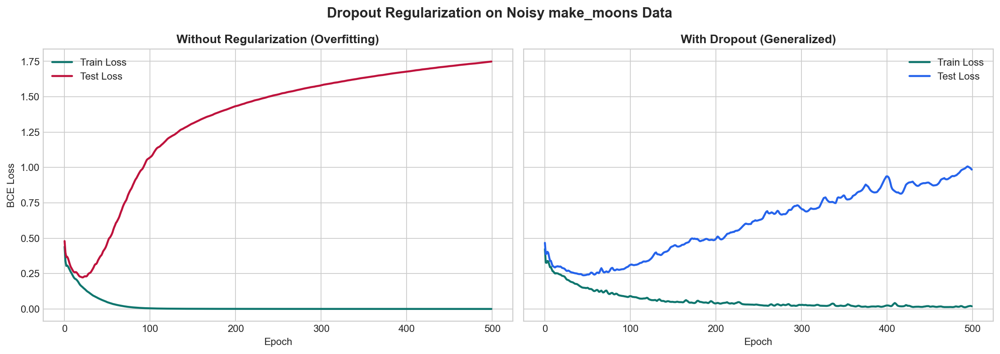

# PyTorch Implementation of Neural Network Dropout

## 📌 Objective
A mathematical replication of the regularization technique introduced in *"Dropout: A Simple Way to Prevent Neural Networks from Overfitting"* (Srivastava et al., 2014). This project demonstrates how randomly omitting hidden units during training prevents complex co-adaptations, thereby significantly reducing overfitting on sparse datasets.

## 🧠 Methodology
Two identically sized Multi-Layer Perceptrons (MLPs) were trained simultaneously on a high-noise, low-sample binary classification dataset to intentionally induce overfitting.
* **Network A:** Standard fully-connected MLP.
* **Network B:** Identical MLP implementing inverted Dropout (`p=0.5`) on hidden layers.

## 📊 Results & Validation
The models were trained for 500 epochs. As hypothesized in the original paper, the standard network memorized the training distribution, resulting in severe degradation of test accuracy (Overfitting). The network utilizing Dropout successfully generalized to the unseen test distribution.

### Loss Curve Comparison

*(Left: The standard model's validation loss diverges rapidly. Right: The Dropout model maintains coupled training and validation loss trajectories, proving generalized learning).*

## ⚙️ How to Run
1. Clone the repository: `git clone https://github.com/YOUR_USERNAME/dropout-optimization-replication.git`
2. Install dependencies: `pip install -r requirements.txt`
3. Run the Jupyter Notebook: `Dropout_Regularization.ipynb`
